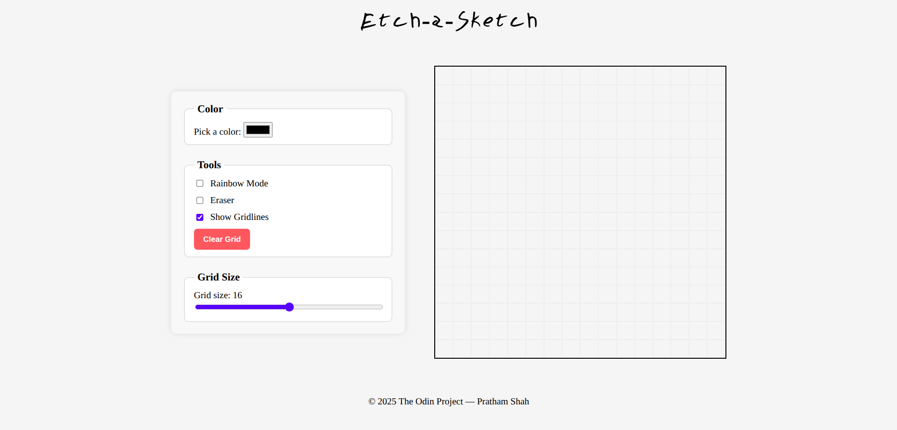

# etch-a-sketch
A simple browser-based Etch-A-Sketch application built with HTML, CSS, and JavaScript made as a project in the Odin Project.

## Features

- Interactive drawing grid
- Adjustable grid size
- Color selection and rainbow mode
- Eraser tool
- Clear/reset button

## Live Website

Open the app in your browser: [https://pratham1019.github.io/etch-a-sketch](https://pratham1019.github.io/etch-a-sketch)

## Usage

- Click and drag on the grid to draw.
- Use the color picker to change the drawing color.
- Toggle rainbow mode for random colors.
- Use the eraser to remove drawings.
- Adjust the grid size with the slider.
- Click "Clear" to reset the grid.

## Screenshots

## Technologies Used

- HTML5
- CSS3
- JavaScript (ES6)

## Contributing

Contributions are welcome! Please open an issue or submit a pull request.
